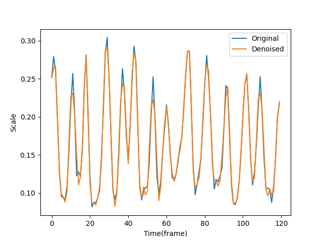

```{r setup, include=FALSE}
options(htmltools.dir.version = FALSE)
knitr::opts_chunk$set(
  fig.width=9, fig.height=3.5, fig.retina=3,
  out.width = "100%",
  cache = FALSE,
  echo = TRUE,
  message = FALSE, 
  warning = FALSE,
  hiline = TRUE
)
```

```{r xaringan-themer, include=FALSE, warning=FALSE}
library(xaringanthemer)
style_duo_accent(
  primary_color = "#CE6D8B",
  secondary_color = "#9448BC",
  inverse_header_color = "#FFFFFF"
)
```


```{r xaringan-extra-styles, include=FALSE}
xaringanExtra::use_extra_styles(
  hover_code_line = TRUE,         #<<
  mute_unhighlighted_code = TRUE  #<<
)
```

```{r xaringan-tachyons, echo=FALSE}
xaringanExtra::use_tachyons()
```

```{r xaringanExtra, echo = FALSE}
xaringanExtra::use_progress_bar(color = "#0051BA", location = "top")
```

```{r xaringan-panelset, echo=FALSE}
xaringanExtra::use_panelset()
```

```{r xaringan-scribble, echo=FALSE}
xaringanExtra::use_scribble()
```

```{r xaringanExtra-search, echo=FALSE}
xaringanExtra::use_search(show_icon = TRUE)
```

```{r xaringan-tile-view, echo=FALSE}
xaringanExtra::use_tile_view()
```

## Outline

.f4.b.purple[

1. Task Description

2. Algorithm
   - Wavelet Factory
   - Algorithm pipeline

3. Evaluation with Simulation

4. Results and Comparison
 
 - vs. baseline `find_peaks()`
 - vs. AMPD

5. Summary

]


---
class: inverse, middle, center

# PART 1
## Task Description

---

## Task Description

### Data
 


### Mission: Peak Detection

---
class: inverse,center,middle

# Part 2

## Algorithm

---


## Wavelet Factory


.f4[ .b[Wavelet Transform] ( Analogue to Fourier Transform )]

$$ C(\Delta, \sigma) = \frac{1}{\sqrt \sigma } \int s(x) w(\frac{t - \Delta}{\sigma})dx $$

 - $\Delta$ : shift parameter
 
 - $\sigma$ : scale parameter
 
 - $w$ : parent wavelet
 
 .center[]
 
---

## Wavelet Factory

.f4.b[ Wavelet Families]


.center[row 1: wavelet for discrete WT  ||  row 2: wavelet for continuous WT]

---

## Wavelet Factory

.f4[.b[wavelet denoise:] wavelet transform recursively + thresholding]

.center[]
.center.f5[LP: low pass | HP: high pass | level = 5 wavelet denoising]

---

## Wavelet Denoise Effect

.panelset[
.panel[.panel-name[Patient 1]
.center[]
]

.panel[.panel-name[Patient 2]
.center[]
]

.panel[.panel-name[Patient 3]

.center[]

]

.panel[.panel-name[Patient 4]

.center[]

]
]


---

## Algorithms Pipeline : WaveMatch

.f4.purple[

- .i[Step 0: Normalize signals to [-1,1]]

- .b[Step 1]: Default  `find_peaks()`

 - => peak indices from original signals


- .b[Step 2]: wavelet denoising + `find_peaks(prominence = 0.1)` 

 - => peak indices from denoised signals
 
 

- .b[Step 3]: Match peak indices in Step 1 and Step 2

- .i[Step 4: Reconstruct Signals]
]

---

## Dive into Algorithm:

.panelset[
.panel[.panel-name[Wavelet Denoise]

- Choose different combinations of wavelet families and members

- Use `skimage.restoration.denoise_wavelet()` for each parent wavelet to denoise the signals

- Do wavelet denoise multiple times to make signals even smoother.

  -  we choose `db4 + coif3 + db4 + coif3` as a combo
  
  -  other choices include adding `sym7`, `sym8` ... 


]

.panel[.panel-name[Denoise Code]

```{python eval=FALSE}
import numpy as np
import pywt
from skimage.restoration import denoise_wavelet


def denoise(data, filters_list):
    """
    denoise with a bunch of filters
    a filter will typically be like:
    filter1 = lambda x: denoise_wavelet(x, *args)
    """
    try:
        for filter in filters_list:
            data = filter(data)
        return data
    except ValueError:
         print("no appropriate filters list!")
```

]

.panel[.panel-name[Match]

- Define a difference (loss function) between peaks indices. A prototype can be

$$\text{diff}(d, o) = \frac{|d - o|}{ke^{s(o)}}$$

- For each peak index got from denoised signals, find a peak index from the original signals with minimal difference.

]

.panel[.panel-name[Match code]

```{python eval=FALSE}
import numpy as np

def match(peak_ids, peak_values, *args):
    '''
    match peaks among multiple arrays
    *args are the peak_ids of denoised signals
    '''
    selected_peaks = []
    for peaks in args:
        for id in peaks:
            difference = (abs(peak_ids-id) + 1) / np.exp(peak_values) #just a prototype
            matched = np.argmin(difference)
            selected_peaks.append(peak_ids[matched])

    return np.unique(selected_peaks)

```
]
]

---
class: inverse, center, middle

# Part 3
## Evaluation with Simulation

---

## Evalution with Simulation


.panelset[
.panel[.panel-name[Simulation]
Generate Signals by following process:

$$s(t) = \lambda_1(t)\sum_i A_i(t)\sin(\omega_i t) + \lambda_2 R_t$$

$$R_t = R_{t-1} + \varepsilon_t, \quad \varepsilon_t \sim \mathcal{N}(0,1)$$

where $A_i$ are random amplitudes and $\lambda_1(t)$ is random loading  for the mixed $\sin$ signals and $\lambda_2$ is loading for the random walk component.

We then manually label the peaks we want.
]

.panel[.panel-name[Simulated Signal]
.center[]
]

.panel[.panel-name[Algorithm result]

.center[]

]

.panel[.panel-name[Confusion Matrix]


|Total           | Positive（PP） | Negative (PN) |
| --------------- | ------------ | ------------- |
| Positive(P) |  72       |  3        |
| Negative(N) |  9        | 61        |

.center[
.b[Accuracy = 91.72%]
]


Actually the result can be even better than literal accuracy: the **FP** and **FT** happens at ambiguous peaks due to manual labelling.

]


]

---
class: inverse, middle, center

# Part 4
## Results and Comparison

---

## Baseline vs. WaveMatch

.panelset[
.panel[.panel-name[Patient 1]
.center[]
]

.panel[.panel-name[Patient 2]
.center[]
]

.panel[.panel-name[Patient 3]

.center[]

]

.panel[.panel-name[Patient 4]

.center[]

]
]

---

## AMPD vs. WaveMatch

Automatic Multiscale-based Peak Detection (AMPD)

- Search an optimal rolling window length and locate one peak in each window.

- Suits quasi-periodical time series. 

.panelset[
.panel[.panel-name[Patient 1]
.center[]
]

.panel[.panel-name[Patient 2]
.center[]
]

.panel[.panel-name[Patient 3]

.center[]

]

.panel[.panel-name[Patient 4]

.center[]

]
]

---
class: inverse, middle, center

# Part 5
## Summary

---

## Summary

- **Hyperparameters**:
   
   - wavelet families/members, levels of denoising
   
   - `find_peak(prominence)`
   
   - difference (loss funciton)
   
--

- **Shortcomings**:

  - lack reliable performance metrics
  
  - didn't tune hyperparameters for different data source
  

--

- **Future Direction**:

  - semi-supervised learning with WaveMatch labelled data
  
  - supervised learning on labelled data


---

## Reference

.f6[Christoph Bueschl, Maria Doppler, Elisabeth Varga, Bernhard Seidl, Mira Flasch, Benedikt Warth, Juergen Zanghellini. (2022). PeakBot: machine-learning-based chromatographic peak picking. Bioinformatics, Volume 38, Issue 13.

Ghaderpour E, Pagiatakis SD, Hassan QK. (2021). A Survey on Change Detection and Time Series Analysis with Applications. Applied Sciences, 11(13):6141.

López-García, Aarón. (2022). SpectroMap: Peak detection algorithm for audio fingerprinting. 10.48550/arXiv.2211.00982. 

Morinan, G., Dushin, Y., Sarapata, G. et al. (2023). Computer vision quantification of whole-body Parkinsonian bradykinesia using a large multi-site population. npj Parkinsons Dis. 9, 10.

Rhif M, Ben Abbes A, Farah IR, Martínez B, Sang Y. (2019). Wavelet Transform Application for/in Non-Stationary Time-Series Analysis: A Review. Applied Sciences. 2019; 9(7):1345.

Scholkmann, F., Boss, J., & Wolf, M. (2012). An Efficient Algorithm for Automatic Peak Detection in Noisy Periodic and Quasi-Periodic Signals. Algorithms, 5, 588-603.]


---
class: inverse, center, middle

# Thanks!


